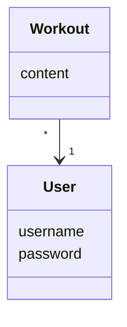
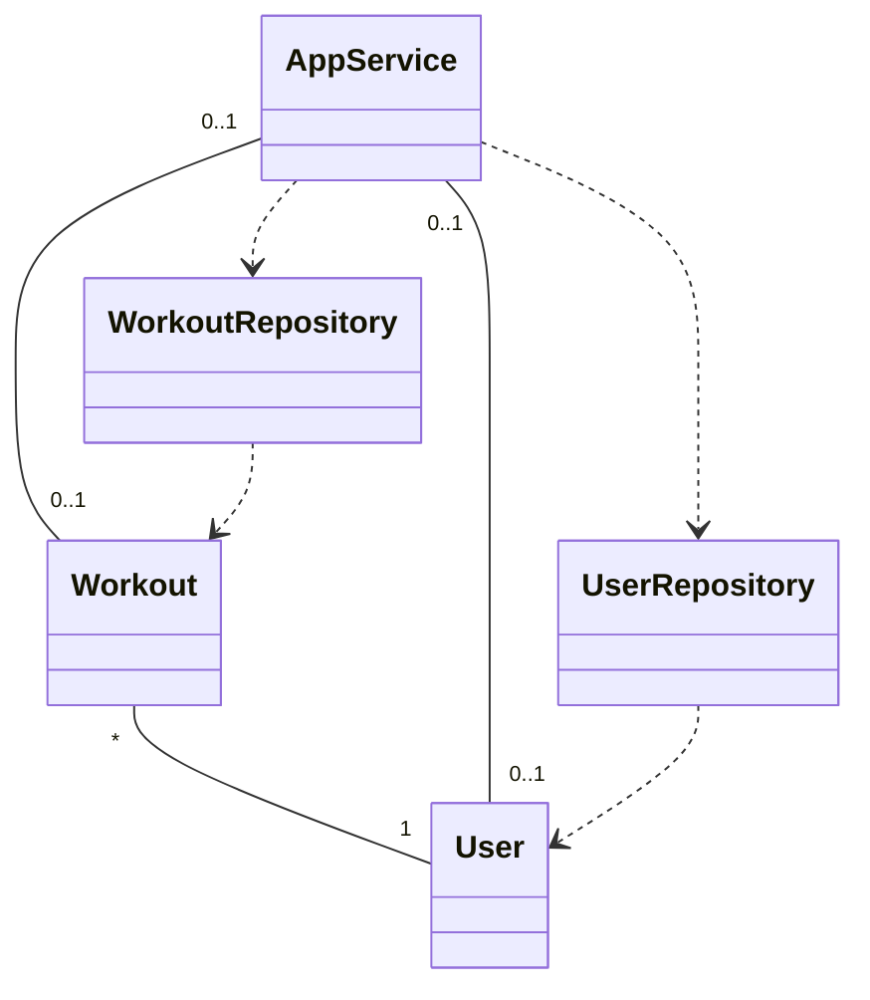
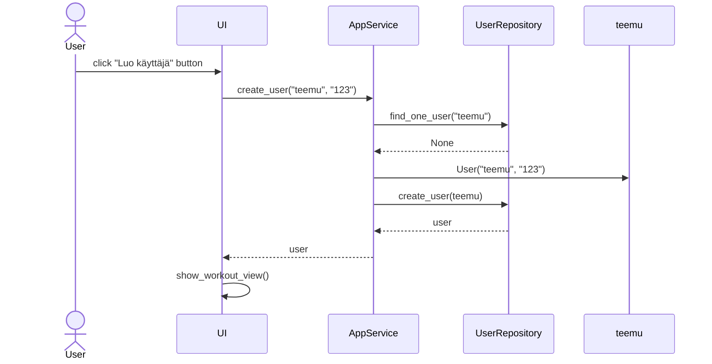

# Ohjelman arkkitehtuuri

## Sovelluslogiikka

Sovellus muodostuu luokista 

- [User](https://github.com/annica-henriette/ot-harjoitustyo/blob/master/src/entities/user.py)
- [Workout](https://github.com/annica-henriette/ot-harjoitustyo/blob/master/src/entities/workout.py)

Luokat kuvaavat käyttäjiä jä heidän treenejä. 

Toiminnallisuudesta vastaa luokka [AppService](https://github.com/annica-henriette/ot-harjoitustyo/blob/master/src/services/app_service.py).

AppService pääsee käsiksi luokkiin User ja Workout luokkien [WorkoutRepository](https://github.com/annica-henriette/ot-harjoitustyo/blob/master/src/repositories/workout_repository.py) ja [UserRepository](https://github.com/annica-henriette/ot-harjoitustyo/blob/master/src/repositories/user_repository.py) kautta.

## Sovelluksen päätoiminnallisuudet

Sovelluksen päätoiminnallisuudet voi kuvata seuraavien sekvenssikaavioiden avulla.

### Käyttäjän luominen

Käyttäjän luomiseen tarvitaan syötteenä käyttäjätunnus, joka ei ole jo käytössä, ja salasana. Tämä jälkeen klikataan "Luo käyttäjä"-painiketta.

### Sisäänkirjautuminen
