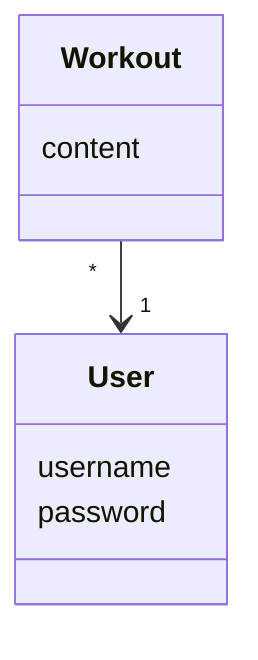
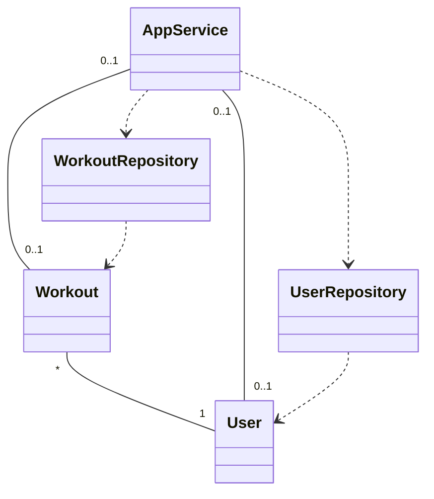
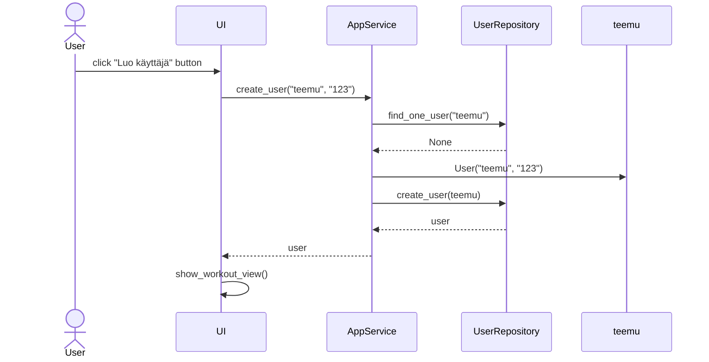
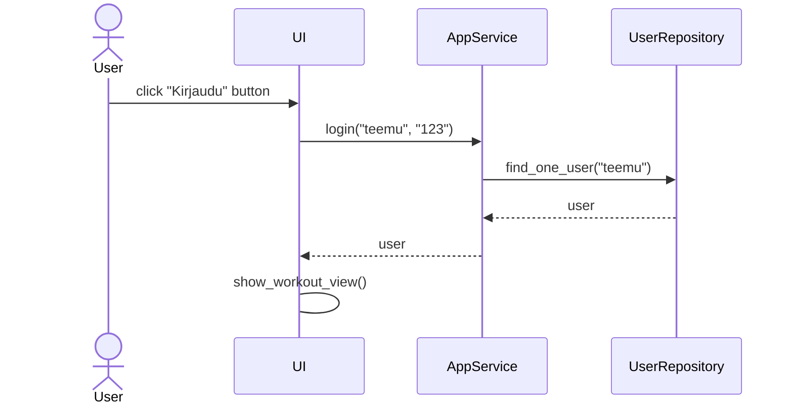

# Ohjelman arkkitehtuuri

## Rakenne
Koodin pakkausrakenne on seuraava:

```mermaid
sequenceDiagram
        participant ui
        participant services
        participant repositories
        participant entities
        ui-->>services
```

## Sovelluslogiikka

Sovellus muodostuu luokista 

- [User](https://github.com/annica-henriette/ot-harjoitustyo/blob/master/src/entities/user.py)
- [Workout](https://github.com/annica-henriette/ot-harjoitustyo/blob/master/src/entities/workout.py)



Luokat kuvaavat käyttäjiä jä heidän treenejä. 

Toiminnallisuudesta vastaa luokka [AppService](https://github.com/annica-henriette/ot-harjoitustyo/blob/master/src/services/app_service.py).

AppService pääsee käsiksi luokkiin User ja Workout luokkien [WorkoutRepository](https://github.com/annica-henriette/ot-harjoitustyo/blob/master/src/repositories/workout_repository.py) ja [UserRepository](https://github.com/annica-henriette/ot-harjoitustyo/blob/master/src/repositories/user_repository.py) kautta.



## Sovelluksen päätoiminnallisuudet

Sovelluksen päätoiminnallisuudet voi kuvata seuraavien sekvenssikaavioiden avulla.

### Käyttäjän luominen

Käyttäjän luomiseen tarvitaan syötteenä käyttäjätunnus, joka ei ole jo käytössä, ja salasana. Tämä jälkeen klikataan "Luo käyttäjä"-painiketta.



Painikkeen painamisen jälkeen sovelluslogiikan `AppService` selvittää käyttäjätunnuksen ja `UserRepository`:n avulla onko käyttäjätunnus jo olemassa. Jos ei ole, sovelluslogiikka luo `User` -olion ja tallentaa sen `UserRepository`:n `create_user` metodin avulla. Käyttäjä on luotu ja näkymäksi vaihtuu kirjautuneen käyttäjän treenipäiväkirja. 

### Sisäänkirjautuminen

Käyttäjä voi kirjautua sovellukseen kirjoittamalla käyttäjätunnuksen ja salasanan syötekenttiin ja klikkaamalla painiketta "Kirjaudu".



Painikkeen painamisen jälkeen sovelluslogiikan `AppService` metodi, käyttäjätunnuksen ja salasanan avulla, selvittää `UserRepository`:n avulla onko käyttäjätunnus jo olemassa. Jos käyttäjätunnus on olemassa ja salasanat täsmäävät, kirjautuminen onnistuu ja käyttöliittymä avaa sovelluksen varsinaisen päänäkymän, eli kirjautuneen käyttäjän treeninäkymän.
