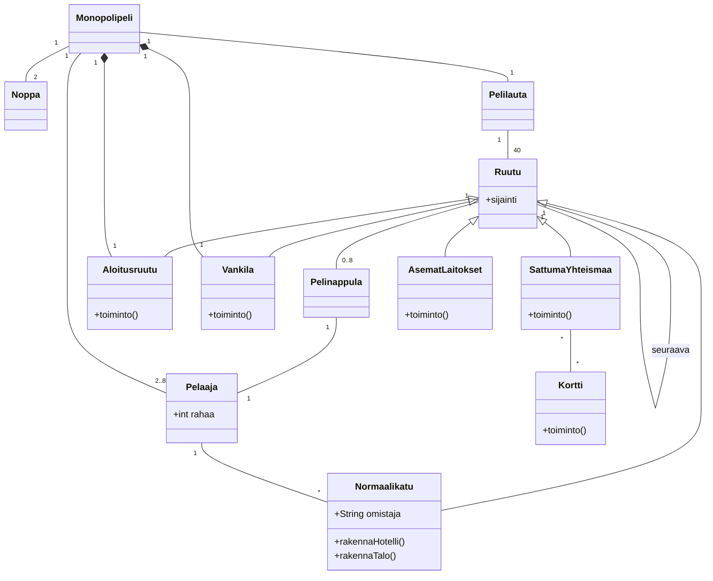

## Monopoli, alustava luokkakaavio

```mermaid
 classDiagram
    Monopolipeli "1" -- "2" Noppa
    Monopolipeli "1" -- "1" Pelilauta
    Pelilauta "1" -- "40" Ruutu
    Ruutu "1" -- "1" Ruutu : seuraava
    Ruutu "1" -- "0..8" Pelinappula
    Pelinappula "1" -- "1" Pelaaja
    Pelaaja "2..8" -- "1" Monopolipeli
    Ruutu <|-- Aloitusruutu
    Ruutu <|-- Vankila
    Ruutu <|-- SattumaYhteismaa
    Ruutu <|-- AsematLaitokset
    Ruutu <|-- Normaalikatu
    class Ruutu {
        +sijainti
    }
    class Aloitusruutu {
        +toiminto()
    }
    class Vankila {
        +toiminto()
    }
    class SattumaYhteismaa {
        +toiminto()
    }
    class AsematLaitokset {
        +toiminto()
    }
    class Normaalikatu {
        +String omistaja
	+rakennaHotelli()
	+rakennaTalo()
    }
    class Kortti {
        +toiminto()
    }
    class Pelaaja {
	+int rahaa
    }
    Monopolipeli "1" *-- "1" Aloitusruutu
    Monopolipeli "1" *-- "1" Vankila
    SattumaYhteismaa "*" -- "*" Kortti
    Pelaaja "1" -- "*" Normaalikatu
```

