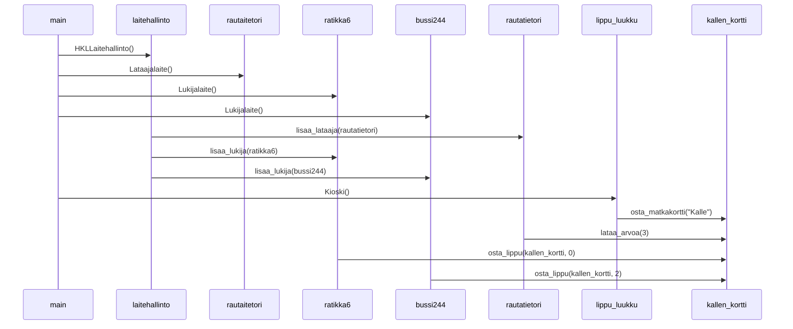

```mermaid
sequenceDiagram
    participant main
    
    main->>laitehallinto: HKLLaitehallinto()
    main->>rautaitetori: Lataajalaite()
    main->>ratikka6: Lukijalaite()
    main->>bussi244: Lukijalaite()
    laitehallinto->>rautatietori: lisaa_lataaja(rautatietori)
    laitehallinto->>ratikka6: lisaa_lukija(ratikka6)
    laitehallinto->>bussi244: lisaa_lukija(bussi244)
    main->>lippu_luukku: Kioski()
    lippu_luukku->>kallen_kortti: osta_matkakortti("Kalle")
    rautatietori->>kallen_kortti: lataa_arvoa(3)
    ratikka6->>kallen_kortti: osta_lippu(kallen_kortti, 0)
    bussi244->>kallen_kortti: osta_lippu(kallen_kortti, 2)
```
